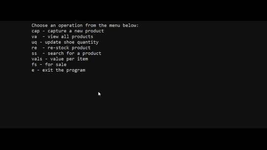

# <span style="color:green;">Inventory_manager  </span>
This program manages shoes inventory.  
User can update the inventory by capturing  
a new shoe, putting on sale the shoe with  
highest quantity and restocking the shoe  
with least quantity. User can also search for  
a specific shoe using shoe code.

# Program requirements
- [] (Python 3 installed)  
- [] (tabulate module installed)  
    ```
    python -m pip install tabulate
    ```
    usage:  
        ```
        from tabulate import tabulate
        ```
# Program usage  

    1. Capture a new shoe
    
    1. View list of all shoes  
    1. Update shoe quantities  
    1. Re-stock the shoe with least quantity  
    1. Search for shoe using shoe code  
    1. Check the shoe on sale (Shoe with greatest quantity)

